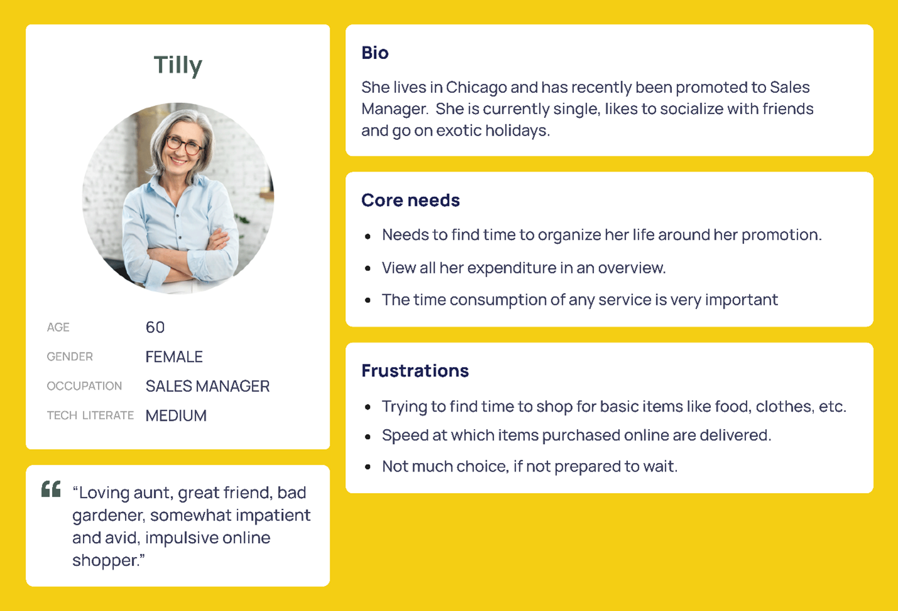

# Principles of UX/UI Design

## What is UX/UI Design?

- UX/UI Design is the process of creating products that provide meaningful and relevant experiences to users. This involves the design of the entire process of acquiring and integrating the product, including aspects of branding, design, usability, and function.

Jacob Nielsen's 5 usability quality components:

1. Learnability

- how easy is it for users to accomplish basic tasks the first time they encounter the design?

2. Efficiency

- once users have learned the design, how quickly can they perform tasks?

3. Memorability

- when users return to the design after a period of not using it, how easily can they reestablish proficiency?

4. Errors

- how many errors do users make, how severe are these errors, and how easily can they recover from the errors?

5. Satisfaction

- how pleasant is it to use the design?

### Empathy tools: Artifacts in the UX process

- User Persona
  A user persona is a fictional character created to represent a user type that might use a site, brand, or product in a similar way. It is a tool that helps designers to empathize with the users and understand their needs, behaviors, and goals.

- Conducting Customer Interviews

Interview at least 5 people. After conducting several interviews, you'll notice that you're getting very little or no new information. This is a good sign that you've reached saturation point and can stop interviewing.

- Making Assumptions

If you've been working on a project for quite some time you may have enough information to make reasonably accurate assumptions about your customers. Just make sure to back them up with research.

- Using Web Analytics

Web analytics tools are excellent resource for quantitative data. They can tell you how your customers behave but not why. You'll still need to talk to them to find out what motivates them.

- Creating A Customer Persona Group

Once you've gathered all the information you need, you can start creating customer persona groups. These groups will help you understand your customers better and make better decisions when designing your product.



First, add a header to your persona; this includes a fictional name, an image, a demographic profile and a quote that summarizes what matters most to your persona. These features ensure your persona is memorable and helps the design team focus on whom they're designing for. Add a personal background, a mini-biography of sorts. Then you create a psychological profile such as the user's needs, interests, motivations, and pain points.

This allows you to understand better why your user behaves in a certain way, including why they need or want to use your product. For Tilly, in the above example, it would be for expediency. When creating user personas, remember to focus on the context of the product you're designing while you want to build up a realistic character. There's no need to include pointless details that won't influence the final design.

User stories
A user story is a brief statement or abstract that describes the user and their need or goal. It establishes who the user is, what they require, and why they require it. Each user persona typically has one user story. User stories usually adhere to a straightforward template:

```markdown
    As a (type of user), I want (a goal) for (some reason).
```

- Type of user: This is the end-user or the user's role in the application software. For example: "As an online banking customer."

- A goal: This is the action taken by the user on the application software. For example: "I want to add a payee to my account."

- Some reason: - The outcome or desired value the user expects from the action performed. For example: "so that I can transfer money to the payee."

> In this example, the user story is:
>
> "As an online banking customer, I want to add a payee to my account, so I can transfer money to the payee."

User stories assist in documenting helpful information about users, such as the various needs and motivations for using a website or app. They also help the development team estimate the timeline required to deliver the final product.

- Scenarios

A scenario is a situation that depicts how users interact with your website or app. Scenarios describe the user's motivations for being there (their task or goal) and a question they need to be answered. They also suggest possible ways to achieve these goals. Scenarios are essentially an extension of the user story and can be applied to various target users. However, they can also be divided into use cases, which describe the sequence of tasks that any given user performs in a provided functionality or path.

For example, a scenario could describe how the user transfers money to a payee using a mobile device on his way to work. Scenarios help stakeholders visualize the design team's ideas by providing context for the intended user experience — frequently bridging communication gaps between creative and business thinking. Scenarios aid the design team in imagining the ideal solution to a user's problem.

Scenario mapping is the first step in scenario planning. The design team, developers, and product owners gather to discuss ideas and design a plan centered on their user personas. They think about the critical task that the user hopes to achieve after defining the primary user through persona development. The following step is to conduct a scenario analysis, contextualize the user's goals and walk through the steps the user would take.

- Storyboards

Storyboards are a series of illustrations that depict the user's journey through a website or app. They are a visual representation of the user's experience and help the design team understand the user's needs and motivations. Storyboards are a great way to communicate ideas and concepts to stakeholders and team members. They can also help identify potential problems and solutions early in the design process.


- **How to create a storyboard**

To create a storyboard, set the scene by defining:

- your persona,

- the environment (where the persona is) and

- the plot (what they want to achieve).

Then you begin to sketch out the basic idea for each scene and build it up with as many interactions as you want.

### 5 stages of UX process

- Empathize - Understand the user's needs and motivations.
- Define - Define the problem you're trying to solve.
- Ideate - Generate ideas to solve the problem.
- Prototype - Create a prototype of your solution.
- Test - Test your solution with real users.

- Customer Journey Maps

A customer journey map is a visual representation of the customer's experience with your product or service. It shows the steps a customer takes to achieve a goal and the emotions they experience along the way. Customer journey maps help you understand your customer's needs and pain points, so you can design a better user experience.


- User Research Tools

1. User Persona
   User personas are fictional characters created to represent the different user types that might use your product or service. They help you understand your users' needs, behaviors, and goals.

2. Empathy Maps
   Empathy maps are visual representations of what your users think, feel, see, and do. They help you understand your users' emotions and motivations.
   Divided into four quadrants: Say, Think, Do, and Feel.

3. Scenarios
   Scenarios are stories that describe how users interact with your product or service. They help you understand your users' goals and motivations.

## Ten Principles of Good Design

1. Good design is innovative
2. Good design makes a product useful
3. Good design is aesthetic
4. Good design makes a product understandable
5. Good design is unobtrusive
6. Good design is honest
7. Good design is long-lasting
8. Good design is thorough down to the last detail
9. Good design is environmentally friendly
10. Good design is as little design as possible

## Jakob Nielsen's 10 Usability Heuristics(Rule of thumb) (10 Good Design Principles)

1. Visibility of system status
2. Match between system and the real world
3. User control and freedom
4. Consistency and standards
5. Error prevention
6. Recognition rather than recall
7. Flexibility and efficiency of use
8. Aesthetic and minimalist design
9. Help users recognize, diagnose, and recover from errors
10. Help and documentation

## 8 Golden Rules of Interface Design (Schneiderman Evaluation)

1. Strive for consistency
2. Enable frequent users to use shortcuts
3. Offer informative feedback
4. Design dialogues to yield closure
5. Offer simple error handling
6. Permit easy reversal of actions
7. Support internal locus of control
8. Reduce short-term memory load

# Evaluation cheat sheets

## Dieter Ram's 10 Principles of Good Design

1. Good design is innovative
   Whether you are making a change or doing something in a new way, developing new ideas or making improvements to existing designs and working alongside new technology, all of these offer a multitude of opportunities for you to be innovative within a design.

2. Good design makes a product useful
   It doesn't matter how stunning a product looks if it is practically unusable as it becomes completely worthless. Products are not pieces of art to be admired. They are there to serve a purpose and solve a problem.

3. Good design is aesthetic
   Beautiful items tend to make us feel comfortable. If a product is beautiful, you may be more inclined to use and want it. Some may argue against this point as you may have your own subjective idea of what is beautiful, and some well-designed items do prioritize utility over beauty. Regardless of your taste, you may like the things around you to be beautiful irrespective of how you define beauty.

4. Good design makes a product understandable
   For example, handles on doors that don't indicate if they should be pushed or pulled or taps that don't indicate if they are hot or cold just leave the user confused. The opposite of this is an instantly understandable product that is completely self-explanatory and communicates what it's about, what it's for and how to use it. This saves a user from breaking the product or spending time reading through instruction manuals.

5. Good design is unobtrusive
   An obtrusive product is an over-designed product. Products that tend to fail are those created with the designer in mind or with presumptions of who the user might be and or how they might use it. The very best products allow the user to do exactly what they want to do. These products should also help the user to complete their intended tasks effectively and happily. The design should not hinder the individual's intuitive process.

6. Good design is honest
   Good design doesn't have tricks! It doesn't pretend to be something that it isn't, and it doesn't try to manipulate you into buying it by making promises that can't be kept. It should always have the user's best interests in mind, so it shouldn't have to try to lie to you or try to be something that it isn't.

7. Good design is long-lasting
   Design should always be thorough to the last detail and avoids being fashionable which means that it never appears old or antiquated.

8. Good design is thorough down to the last detail
   A Good design should be detail-oriented and leave nothing to chance. Every single aspect of the design should be considered, and all the elements should qualify to be a part of that design. Products should be designed with care, thoroughness, and concern for the intended user.

9. Good design is environmentally friendly
   Pollution can arise from wasted resources throughout a product's lifespan. Design shouldn't be wasteful and should save resources where it can, both physically and digitally.

10. Good design is as little as possible
    Design should always be intentional. Anything that doesn't serve a purpose for the user should be excluded. With less clutter, a design will achieve more clarity for the user.

## Jakob Nielsen's Heuristics: 10 Usability Principles to Improve UI Design

1. Visibility of system status
   Explore your smartphone. Right after the screen lights up, it informs you about its battery and if you have a Wi-Fi connection, any received messages, missed calls and much more. Imagine how insecure you would feel if this information were missing. The system communicates its status and assists users in making better, more informed decisions by using signs, icons and indicators.

2. Match between the system and the real world
   Users may make assumptions about how a system will work based on their previous experiences with similar systems. You can help them overcome their initial discomfort by using language they are familiar with.

3. User control and freedom
   Digital spaces, like physical spaces, require quick 'emergency exits'. Users frequently select system functions by accident and need a clearly marked way to leave the unwanted position without going through an extended dialogue. So, support the undo and redo functions.

4. Consistency and standards
   Consistency is the key. A 'submit' button on one page should look the same across the site on any page. If you show information in a particular format on one page, it should look the same on all pages.

5. Error prevention
   A careful design that prevents a problem from occurring in the first place is even better than good error messages. Remove conditions that may cause errors in your design, or look for them and give your users a confirmation option so that they can make an informed decision before tapping or selecting anything.

6. Recognition rather than recall
   Allow your users to recognize information in the user interface rather than expecting them to remember or recall it. Simply put, don't make your users work any harder than necessary! Make your navigation as clear, detailed and straightforward as possible. Offer them hints, remind them when something time-sensitive needs to be done and notify them when a screen or a process has been changed.

7. Flexibility and efficiency of use
   Simply put, your system must be designed so that both experienced and inexperienced users can use it. Think of designing a system where a new user can find a way to perform a task without knowing any shortcuts. However, also design your system in such a way that an experienced user can use shortcuts to complete the action quickly and efficiently.

8. Aesthetic and minimalistic design
   Make a fantastic first impression! Users notice aesthetics or how visually appealing your system is in the first 50 milliseconds of landing on a page, which is ten times faster than it takes them to read it. This means that you should make sure that you establish and reinforce your system's brand identity and credibility.

9. Help users recognize, diagnose and recover from errors
   A good error message should be polite, easy to understand, precise, constructive, clearly visible, and take as little time as possible to fix the problem as well as educate your users.

10. Help and documentation
    Even though it is preferable that your system can be used without documentation. It is important that any such information should be: easy to find, focused on the user's task, include the actual steps they should take, and not be too large.

## Ben Shneidermann's 8 Golden Rules of Interface Design

1. Strive for consistency
   Consistency is critical to maintaining uniformity throughout the site, whether it's the layout, the size of the button, the color code, or the tone used when writing the page. Consistency will enable you to establish your identity and stop users from abandoning your site.

2. Enable frequent users to use shortcuts
   Think about allowing your users to access all areas of your website with a few clicks. To accomplish this, you should create a good hierarchy in the menu and make things clear. Consider including features for both advanced and novice users, such as keyboard shortcuts or macro-capabilities.

3. Offer informative feedback
   If your users have completed or are completing activities on your website, it is best to provide feedback as soon as possible so that they can understand where they are in the system.

4. Design dialog to yield closure
   All interactions must have a beginning, middle and end. Once a task is completed, maybe give your users some peace of mind by providing them with informative feedback and well-defined choices for the next step, if applicable. Don't keep them guessing!

5. Offer simple error handling
   An interface should be designed to eliminate as many errors as possible. If something goes wrong, the system should make it simple for users to understand and resolve the problem. A good idea is to display clear error notifications and descriptive hints to resolve the problem. These are examples of simple ways to deal with system errors.

6. Permit easy reversal of actions
   Finding that there is an "undo" option after making a mistake is a huge relief. Your users should feel less anxious and more likely to explore options if they know there is a simple way to undo any mistakes. This rule applies to any action, sequence of steps or data entry in your system. This can range from a single button to a complete set of actions.

7. Support internal locus of control
   It is essential to give your users control and freedom so that they feel in control of the system instead of the other way around. As the designer, try to avoid surprises, interruptions and anything that the users didn't request. Users should be the ones who initiate actions.

8. Reduce short-term memory load
   As users, our attention span may be limited, so anything you can do to make your users' jobs easier is a win-win situation. Your users may prefer to recognize information rather than recall it. Try to keep interfaces simple and consistent and keep to patterns, standards and conventions. This may contribute to better recognition and ease of use. Depending on your users' objectives, you can add various features to help them. In an e-commerce setting, for example, a list of recently viewed or purchased items can be presented.
